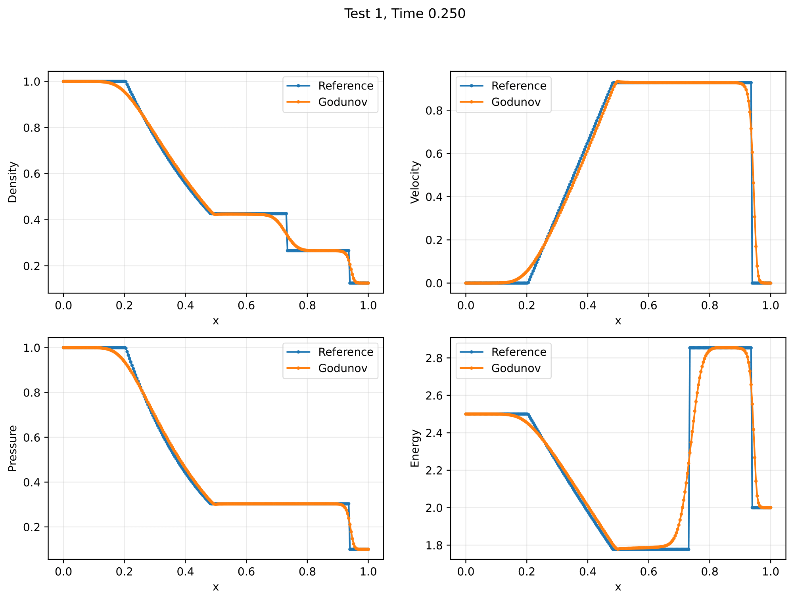
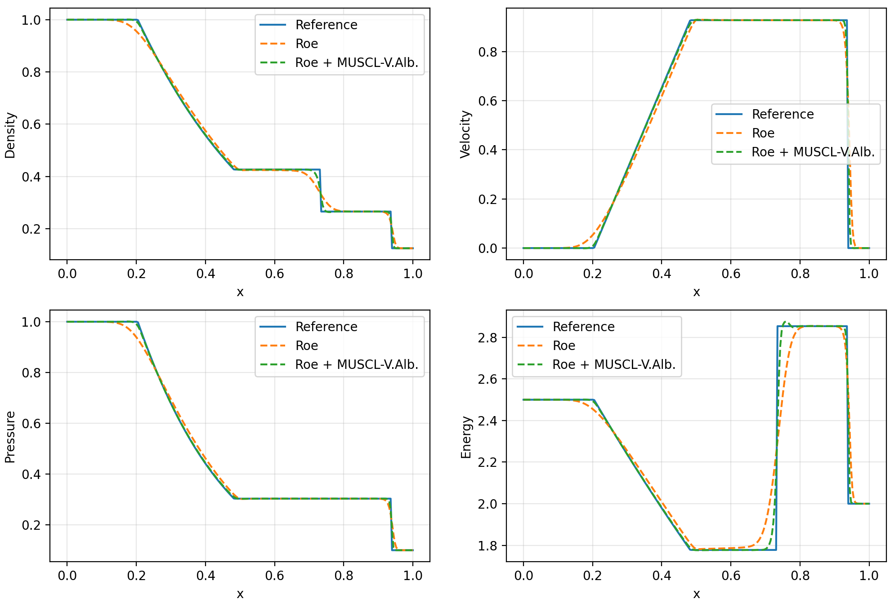
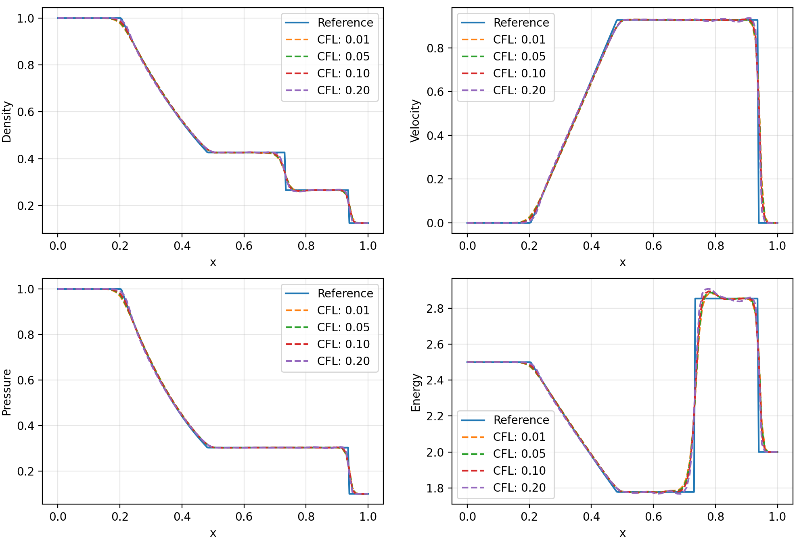
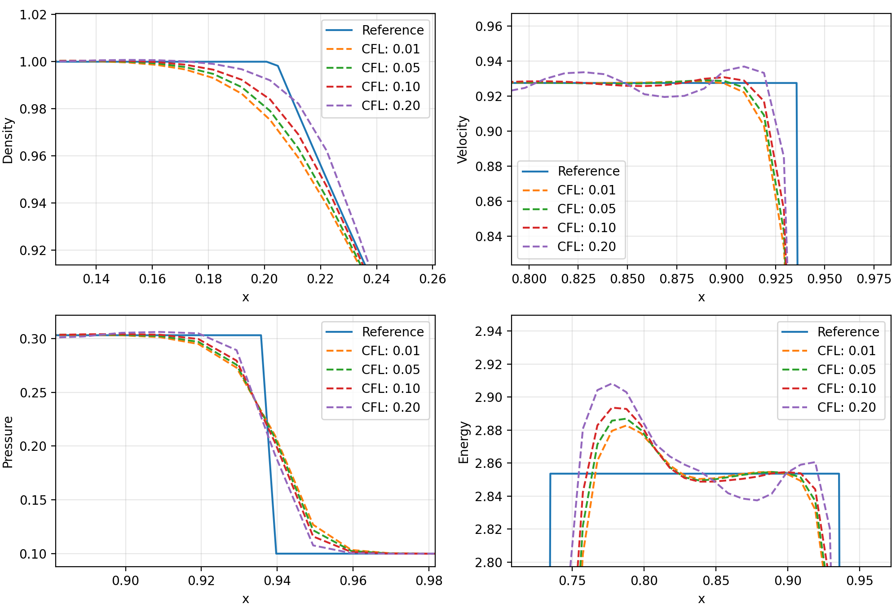
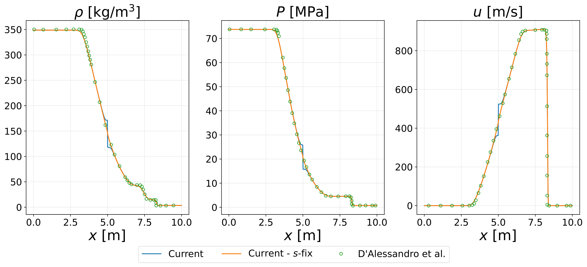

# PyShockTube #


### What is this repository for? ###

* Resolution of shock tube problems for both ideal and real gases.
* Learning of numerical flux details, effects and implementation.
* Implementation and testing of new numerical schemes to solve the 1D Euler Equations.


### How do I get set up? ###

* git clone the present folder

* Download Conda on your system

* Create a new environment with Conda (e.g. pyshock), with the following python version.
```bash
conda create --name pyshock python=3.12.2
```

* Activate the new environment
```bash
conda activate pyshock
```

* Download and install the needed python packages
```bash
cd pyshocktube
pip install .
```

* Navigate to the test cases folder, and run any of the main python files in the folders
```bash
python main.py
```

- The input parameters are specified inside every `main.py` file, and should be quite easy to comprehend and modify. The legend for the input variables is the following (SI units):
```python
LENGTH: length of the tube
NX: number of points for the space-discretization
FLUID: name of the fluid
FLUID_MODEL: ideal or real
FLUID_GAMMA: cp/cv ratio (needed if ideal gas mode is selected) 
CFL_MAX: approximate Max CFL condition to respect at first time-step
NUMERICAL_SCHEME: Roe, Godunov, WAF, MUSCL-Hancock
BOUNDARY_CONDITIONS: reflective, transparent or periodic
RHOL, RHOR: initial left and right values of density
UL, UR: initial left and right values of velocity
PL, PR: initial left and right values of pressure
HIGH_ORDER: True or False to enable MUSCL reconstruction with Van Albada Limiter
```


### Notes ###
* The code has been written for Mac OS systems, so there is the chance for some path-related commands to not run correctly
on windows based machines. It should be quite easy to fix. With time the code will be made more universal.


### Results Example ###

##### Godunov Scheme for ideal gas (air) #####
Test case for ideal gas (air) documented in [1].
The following picture reports comparison between the reference data obtained with the analytical riemann solver, and simulation results obtained with the Godunov scheme for ideal gas.


##### Roe Scheme for ideal gas (air) with High-Order Reconstruction #####
Test case for ideal gas (air) documented in [1], solved with Roe's scheme and MUSCL reconstruction + Van Albada limiter [3].
The following picture reports the comparison between the solutions with and without high-order reconstruction.


Given the sensitivity of high-order reconstruction to the simulation time-step, the following picture reports the comparison between the reference data obtained with the analytical riemann solver, and simulation results obtained with different time-steps.

Zooming in in the critical areas shows the time-step sensitivity.


##### CO2 with real gas effects #####
Test case for real gas effects documented in [4]. The generalised Roe's scheme formulation has been taken from [2].
The following picture reports comparison between the reference data from the article, and two simulations run with the
Roe's generalized scheme for real gas, with and without Entropy fix.


### Contribution guidelines ###

* Validate the modifications by means of detailed test cases
* Push the code

### Who do I talk to? ###

* Francesco Neri, TU Delft
* Matteo Pini, TU Delft

### References ###

[1] Toro, Eleuterio F. Riemann solvers and numerical methods for fluid dynamics: a practical introduction. Springer Science & Business Media, 2013.

[2] Arabi, Sina, Jean-Yves Trépanier, and Ricardo Camarero. "A simple extension of Roe's scheme for real gases." Journal of Computational Physics 329 (2017): 16-28.

[3] Blazek, Jiri. Computational fluid dynamics: principles and applications. Butterworth-Heinemann, 2015.

[4] D’Alessandro, Simone, Marco Pizzarelli, and Francesco Nasuti. "A hybrid real/ideal gas mixture computational framework to capture wave propagation in liquid rocket combustion chamber conditions." Aerospace 8.9 (2021): 250.