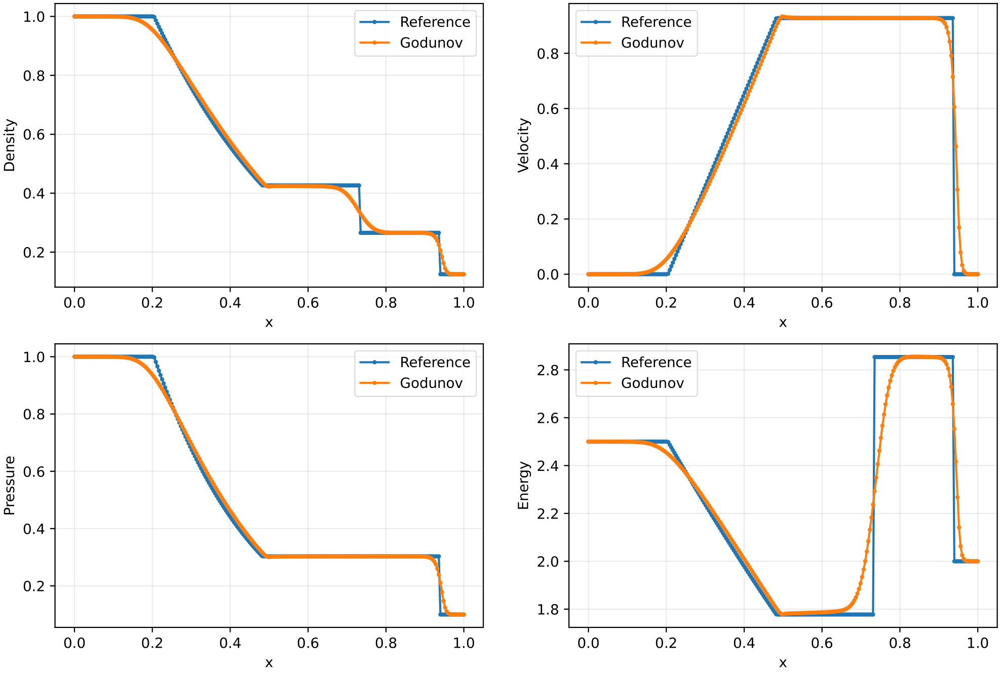

# PyShockflow #


### What is this repository for? ###

* Resolution of quasi-1D flow problems for ideal and real gases.
* Learning of numerical flux schemes, effects and implementation.
* Implementation and testing of new numerical schemes to solve the 1D Euler Equations.
* Study of non-ideal and non-classical gas dynamics effects.


### How do I get set up? ###

* Git clone the present folder in your system

* Clone the conda environment from the provided yaml file:
```bash
conda env create -f environment.yml
```

* Activate the new environment:
```bash
conda activate pyshockflow
```

* Navigate to the package and and install it on your machine:
```bash
cd pyshockflow
pip install . -e
```

* Navigate to the test cases folder (or create one), and run the main.py file:
```bash
python main.py
```

* The input parameters are specified inside every `input.ini` file, and should be quite easy to comprehend and modify. The content of input files
can be taken from the testcases folder, or alternatively checking the Config.py class.


### Notes ###
* The code has been written for Mac OS systems, so there is the chance for some path-related commands to not run correctly
on windows based machines. It should be quite easy to fix. With time the code will be made more universal.

* The technical details can be found in the related article ...


### Results Example ###

##### Godunov Scheme for ideal gas (air) #####
Test case for ideal gas (air), documented in [1].
The following picture reports the comparison between the reference data obtained with the analytical Riemann Solver, and the simulation results obtained with the Godunov scheme for ideal gas:



##### CO2 with real gas effects #####
Test case for real gas effects documented in [4]. The generalised Roe's scheme formulation has been taken from [2].
The following picture reports comparison between the reference data from the article, and two simulations run with the
Roe's generalized scheme for real gas, with and without Entropy fix.


### Contribution guidelines ###

* Validate the modifications by means of detailed test cases
* Push the code

### Authors and contacts ###

- **Francesco Neri**, TU Delft, `f.neri@tudelft.nl`
- **Matteo Pini**, TU Delft, `m.pini@tudelft.nl`

### References ###

[1] Toro, Eleuterio F. Riemann solvers and numerical methods for fluid dynamics: a practical introduction. Springer Science & Business Media, 2013.

[2] Arabi, Sina, Jean-Yves Tr�panier, and Ricardo Camarero. "A simple extension of Roe's scheme for real gases." Journal of Computational Physics 329 (2017): 16-28.

[3] Blazek, Jiri. Computational fluid dynamics: principles and applications. Butterworth-Heinemann, 2015.

[4] D�Alessandro, Simone, Marco Pizzarelli, and Francesco Nasuti. "A hybrid real/ideal gas mixture computational framework to capture wave propagation in liquid rocket combustion chamber conditions." Aerospace 8.9 (2021): 250.

[5] Hirsch, Charles. Numerical computation of internal and external flows: The fundamentals of computational fluid dynamics. Elsevier, 2007.